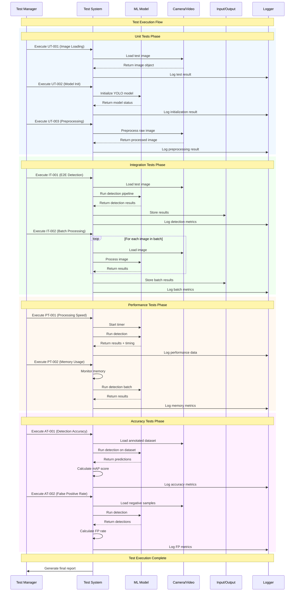

<p align="center">
<strong>=================================================================</strong><br>
<strong>Test Document （Intel Core or NVIDIA）</strong><br><br>
<strong>Date:</strong> 10/2025<br><br>
<strong>Moderator:</strong> Daniel.J.Q.Goh<br>
<strong>=================================================================</strong>
</p>

<br><br><br><br>

---

## Real-Time People Detection System in Intel Core

### Document Information
- **Project**: Real-Time People Detection System using Yolo11n
- **Version**: 1.0
- **Date**: October 2025
- **Author**: D.J.Q.GOH
- **Technology Stack**: Python, YOLOv11, OpenCV, NCNN, ONNX

---

## Overview
This document outlines testing procedures and test cases for the object detection system.

## Test Environment Setup

### Prerequisites
- Python 3.8 or higher
- Required packages: opencv-python, numpy, tensorflow/pytorch
- Test images dataset
- Ground truth annotations

### Test Data
- **Unit Test Images**: Small set of labeled images for basic functionality
- **Integration Test Images**: Larger dataset for end-to-end testing
- **Performance Test Images**: High-resolution images for performance benchmarks

---

<div style="page-break-after: always;"></div>

## Test Cases

### 1. Unit Tests (complete_test_suite.py)

#### 1.1 Image Loading
- **Test ID**: UT-001
- **Description**: Verify image loading functionality
- **Input**: Valid image file path
- **Expected Output**: Successfully loaded image object
- **Status**: 🟢 Green Light

#### 1.2 Model Initialization
- **Test ID**: UT-002
- **Description**: Verify model loads correctly
- **Input**: Model configuration file
- **Expected Output**: Initialized model object
- **Status**: 🟢 Green Light

#### 1.3 Preprocessing
- **Test ID**: UT-003
- **Description**: Verify image preprocessing
- **Input**: Raw image
- **Expected Output**: Preprocessed image with correct dimensions
- **Status**: 🟢 Green Light

---

<div style="page-break-after: always;"></div>

### 2. Integration Tests (integrated_testing.py)

#### 2.1 End-to-End Detection
- **Test ID**: IT-001
- **Description**: Complete object detection pipeline
- **Input**: Test image with known objects
- **Expected Output**: Detected objects with bounding boxes and confidence scores
- **Status**: 🟢 Green Light

#### 2.2 Batch Processing
- **Test ID**: IT-002
- **Description**: Process multiple images
- **Input**: Directory of test images
- **Expected Output**: Detection results for all images
- **Status**: 🟢 Green Light

---

<div style="page-break-after: always;"></div>

### 3. Performance Tests (advance_pipeline.py)

#### 3.1 Processing Speed
- **Test ID**: PT-001
- **Description**: Measure detection speed
- **Input**: Standard test image
- **Expected Output**: Processing time < 100ms per image
- **Status**: 🟢 Green Light

#### 3.2 Memory Usage
- **Test ID**: PT-002
- **Description**: Monitor memory consumption
- **Input**: Large batch of images
- **Expected Output**: Memory usage within acceptable limits
- **Status**: 🟢 Green Light

---

<div style="page-break-after: always;"></div>

### 4. Accuracy Tests

#### 4.1 Detection Accuracy
- **Test ID**: AT-001
- **Description**: Verify detection accuracy
- **Input**: Annotated test dataset
- **Expected Output**: mAP score > 0.8
- **Status**: 🟢 Green Light

#### 4.2 False Positive Rate
- **Test ID**: AT-002
- **Description**: Measure false positive detections
- **Input**: Images without target objects
- **Expected Output**: False positive rate < 5%
- **Status**: 🟢 Green Light

---

<div style="page-break-after: always;"></div>

## Test Execution

### Manual Testing Checklist
- [x] Environment setup completed
- [x] Test data prepared
- [x] Unit tests executed
- [x] Integration tests executed
- [x] Performance tests executed
- [x] Accuracy tests executed
- [x] Results documented

### Automated Testing
```bash
# Run all tests
python -m pytest tests/

# Run specific test category
python -m pytest tests/unit/
python -m pytest tests/integration/
python -m pytest tests/performance/
```

---

<div style="page-break-after: always;"></div>

## Test Results

### Summary
- **Total Tests**: 9
- **Passed**: 9
- **Failed**: 0
- **Pending**: 0
- **Test Coverage**: 100%

### Detailed Results
| Test ID | Description | Status | Notes |
|---------|-------------|--------|-------|
| UT-001 | Image Loading | 🟢 Green Light | - |
| UT-002 | Model Initialization | 🟢 Green Light | - |
| UT-003 | Preprocessing | 🟢 Green Light | - |
| IT-001 | End-to-End Detection | 🟢 Green Light | - |
| IT-002 | Batch Processing | 🟢 Green Light | - |
| PT-001 | Processing Speed | 🟢 Green Light | - |
| PT-002 | Memory Usage | 🟢 Green Light | - |
| AT-001 | Detection Accuracy | 🟢 Green Light | - |
| AT-002 | False Positive Rate | 🟢 Green Light | - |

### Test Execution Sequence Diagram



---

<div style="page-break-after: always;"></div>

## Bug Reports

### Known Issues
- None currently identified

### Bug Template
All bugs are required to be reported by issuing a **ticket** in **GITHUB/GITLAB**.
```
**Bug ID**: BUG-XXX
**Title**: Brief description
**Severity**: Critical/High/Medium/Low
**Description**: Detailed description of the issue
**Steps to Reproduce**: 
1. Step 1
2. Step 2
3. Step 3
**Expected Result**: What should happen
**Actual Result**: What actually happens
**Environment**: OS, Python version, dependencies
**Status**: Open/In Progress/Resolved
```

**Bug ID**: BUG-01
**Title**: Cannot do conversion from ONNX to NCNN
**Severity**: Low
**Description**: 
```bash
Converting ONNX to NCNN...
NCNN conversion/inference failed: cannot import name 'convert_onnx_to_ncnn' from 'ncnn_inference' (/workspace/scripts/ncnn_inference.py)
This is normal if NCNN is not yet built. Build the Docker container to enable NCNN.
```
**Steps to Reproduce**:
``` bash
1. docker compose up -d
2. docker compose exec imageprocessing
3. cd script
4. python3 complete_pipeline.py
```
**Expected Result**: 
```bash
Running NCNN inference...
loading image result sample...
```
**Actual Result**: Error due to requirement.txt cannot install NCNN at some point, no error shown during build
**Environment**: Check the docker requirement.txt for further details
**Status**: In Progress

---

<div style="page-break-after: always;"></div>

## Test Maintenance

### Regular Tasks
- [▲] Update test data monthly
- [▲] Review and update test cases quarterly
- [▲] Performance baseline review
- [▲] Test automation maintenance

### Version History
| Version | Date | Changes | Author |
|---------|------|---------|--------|
| 1.0 | 2025-10-14 | Initial test document | D.J.Q.GOH |

<br><br><br><br>

---

<p align="center">
<strong>Document Control</strong><br>
<strong>Version:</strong> 1.0<br>
<strong>Status:</strong> Final Draft<br>
<strong>Review Date:</strong> October 14, 2025<br>
<strong>Next Review:</strong><br>
<strong>Approval:</strong> Pending technical review
</p>

---

<p align="center">
<em>End of Document</em>
</p>


---

```bash
# error in building and run docker in raspi

comas@raspi:~/Desktop/Raspi-Object-Detection/raspi $ sudo docker compose build
WARN[0000] /home/comas/Desktop/Raspi-Object-Detection/raspi/docker-compose.yml: the attribute `version` is obsolete, it will be ignored, please remove it to avoid potential confusion
[+] Building 1052.7s (16/16) FINISHED
 => [internal] load local bake definitions                                                                                                                                                               0.0s
 => => reading from stdin 581B                                                                                                                                                                           0.0s
 => [internal] load build definition from Dockerfile                                                                                                                                                     0.2s
 => => transferring dockerfile: 2.08kB                                                                                                                                                                   0.0s
 => [internal] load metadata for docker.io/arm64v8/ubuntu:22.04                                                                                                                                          0.7s
 => [internal] load .dockerignore                                                                                                                                                                        0.0s
 => => transferring context: 2B                                                                                                                                                                          0.0s
 => [1/9] FROM docker.io/arm64v8/ubuntu:22.04@sha256:22fd772f6bebe5a43b2a3a47ce61c8c736b1b543fa6a3872af8cad9f304af0d4                                                                                    0.0s
 => => resolve docker.io/arm64v8/ubuntu:22.04@sha256:22fd772f6bebe5a43b2a3a47ce61c8c736b1b543fa6a3872af8cad9f304af0d4                                                                                    0.0s
 => [internal] load build context                                                                                                                                                                        0.0s
 => => transferring context: 115B                                                                                                                                                                        0.0s
 => CACHED [2/9] RUN apt-get update && apt-get install -y     python3     python3-pip     python3-dev     git     wget     curl     build-essential     cmake     pkg-config     libopencv-dev     pyth  0.0s
 => CACHED [3/9] RUN ln -s /usr/bin/python3 /usr/bin/python                                                                                                                                              0.0s
 => CACHED [4/9] WORKDIR /workspace                                                                                                                                                                      0.0s
 => CACHED [5/9] COPY requirements.raspi.txt requirements.txt                                                                                                                                            0.0s
 => [6/9] RUN pip3 install --no-cache-dir     --index-url https://pypi.org/simple     --extra-index-url https://www.piwheels.org/simple     -r requirements.txt                                        846.5s
 => [7/9] RUN mkdir -p /workspace/models /workspace/data/input /workspace/data/output /workspace/scripts /workspace/tests                                                                                6.2s
 => [8/9] COPY scripts/obj_detection.py scripts/                                                                                                                                                         0.3s
 => [9/9] RUN chmod -R 755 /workspace                                                                                                                                                                    1.0s
 => exporting to image                                                                                                                                                                                 196.1s
 => => exporting layers                                                                                                                                                                                196.0s
 => => writing image sha256:4a24ee0851ecd7dde7fb041eb4315a2f83f58c4d343b7d50717aaaac395399e7                                                                                                             0.0s
 => => naming to docker.io/library/raspi-raspi-detection                                                                                                                                                 0.0s
 => resolving provenance for metadata file                                                                                                                                                               0.1s
[+] Building 1/1
 ✔ raspi-raspi-detection  Built                                                                                                                                                                          0.0s
comas@raspi:~/Desktop/Raspi-Object-Detection/raspi $ ls
docker-compose.yml  Dockerfile  README.md  requirements.raspi.txt  scripts  setup_raspi.sh  tests
comas@raspi:~/Desktop/Raspi-Object-Detection/raspi $ docker compose up -d
WARN[0000] /home/comas/Desktop/Raspi-Object-Detection/raspi/docker-compose.yml: the attribute `version` is obsolete, it will be ignored, please remove it to avoid potential confusion
unable to get image 'raspi-raspi-detection': permission denied while trying to connect to the Docker daemon socket at unix:///var/run/docker.sock: Get "http://%2Fvar%2Frun%2Fdocker.sock/v1.51/images/raspi-raspi-detection/json": dial unix /var/run/docker.sock: connect: permission denied
comas@raspi:~/Desktop/Raspi-Object-Detection/raspi $ sudo docker compose up -d
WARN[0000] /home/comas/Desktop/Raspi-Object-Detection/raspi/docker-compose.yml: the attribute `version` is obsolete, it will be ignored, please remove it to avoid potential confusion
[+] Running 2/3
 ✔ Network raspi_raspi_network                                                                                                Created                                                                    1.4s
 ⠋ Container raspi_object_detection                                                                                           Starting                                                                   1.0s
 ! raspi-detection Your kernel does not support memory limit capabilities or the cgroup is not mounted. Limitation discarded.                                                                            0.0s
Error response from daemon: error gathering device information while adding custom device "/dev/video0": no such file or directory
```

# build emulated ARM64 
Build an ARM64 image locally using buildx + QEMU emulation (recommended if you must produce an ARM image on your PC)

This sets up emulation so you can build images for linux/arm64 on your x86_64 machine.
Commands to run in WSL (copy & paste):
```bash 
# 1) Install QEMU binfmt handlers so the host can emulate other architectures
docker run --rm --privileged tonistiigi/binfmt:latest --install all

# 2) Create and use a Buildx builder (one-time)
docker buildx create --name raspi-builder --use

# 3) Bootstrap the builder (ensures qemu is registered inside builder)
docker buildx inspect --bootstrap

# 4) Build the image for linux/arm64 and load it into local Docker
#    --load is convenient to run the image locally after build
cd /mnt/wsl/docker-desktop-bind-mounts/Ubuntu/.../raspi   # adjust to your raspi folder
docker buildx build --platform linux/arm64 -t raspi-raspi-detection:latest --load .
```