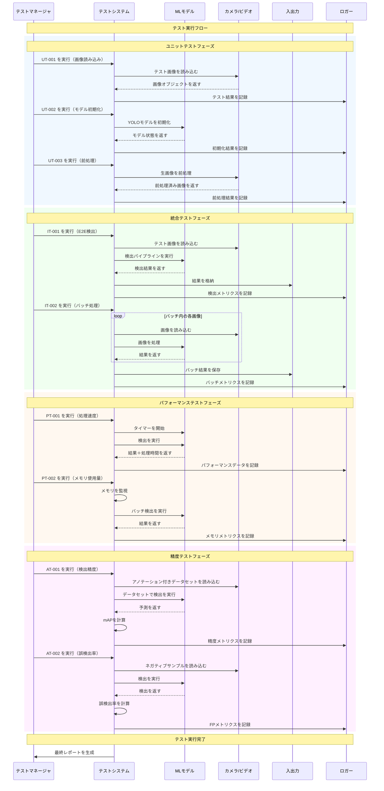

<p align="center">
<strong>=================================================================</strong><br>
<strong>テスト詳細（Intel Core or NVIDIA）</strong><br><br>
<strong>日付:</strong> 10/2025<br><br>
<strong>モデレーター:</strong> Daniel.J.Q.Goh<br>
<strong>=================================================================</strong>
</p>

<br><br><br><br>

---

## Intel Coreを用リアルタイム人物検出システム

### 文書情報
- **プロジェクト**: Yolo11nを用いてリアルタイム人物検出システム
- **バージョン**: 1.0
- **日付**: 2025年10月
- **著者**: D.J.Q.GOH
- **技術スタック**: Python, YOLOv11, OpenCV, NCNN, ONNX

---

## 概要
この文書は、オブジェクト検出システムのテスト手順とテストケースをまとめたものです。

## テスト環境セットアップ

### 前提条件
- Python 3.8以上
- 必要パッケージ: `opencv-python`, `numpy`, `tensorflow`/`pytorch`
- テスト用画像データセット
- 正解ラベル（アノテーション）

### テストデータ
- **ユニットテスト画像**：基本機能確認用の小規模ラベル付き画像セット
- **統合テスト画像**：エンドツーエンド検証用の大規模データセット
- **パフォーマンステスト画像**：処理速度およびメモリ測定用の高解像度画像

---

<div style="page-break-after: always;"></div>

## テストケース

### 1. ユニットテスト (`complete_test_suite.py`)

#### 1.1 画像読み込み
- **テストID**: UT-001
- **目的**: 画像読み込み機能が正しく動作することを確認する
- **入力**: 有効な画像ファイルパス
- **期待結果**: 画像オブジェクトが正常に読み込まれる
- **ステータス**: 🟢 合格

#### 1.2 モデル初期化
- **テストID**: UT-002
- **目的**: モデルが正しくロードされ初期化されることを確認する
- **入力**: モデル設定ファイル
- **期待結果**: 初期化済みのモデルオブジェクトを返す
- **ステータス**: 🟢 合格

#### 1.3 前処理
- **テストID**: UT-003
- **目的**: 画像前処理（リサイズ、正規化等）が正しく行われることを確認する
- **入力**: 生画像
- **期待結果**: 所定の寸法・フォーマットで前処理された画像を得られる
- **ステータス**: 🟢 合格

---

<div style="page-break-after: always;"></div>

### 2. 統合テスト (`integrated_testing.py`)

#### 2.1 エンドツーエンド検出
- **テストID**: IT-001
- **目的**: 検出パイプラインが期待通りに動作するかを検証する
- **入力**: 既知のオブジェクトを含むテスト画像
- **期待結果**: バウンディングボックスと信頼度スコア付きの検出結果
- **ステータス**: 🟢 合格

#### 2.2 バッチ処理
- **テストID**: IT-002
- **目的**: 複数画像のバッチ処理が正しく行えることを確認する
- **入力**: テスト画像ディレクトリ
- **期待結果**: 全画像に対する検出結果を出力する
- **ステータス**: 🟢 合格

---

<div style="page-break-after: always;"></div>

### 3. パフォーマンステスト (`advance_pipeline.py`)

#### 3.1 処理速度
- **テストID**: PT-001
- **目的**: 画像あたりの処理時間を測定する
- **入力**: 標準テスト画像
- **期待結果**: 1画像あたりの処理時間 < 100ms
- **ステータス**: 🟢 合格

#### 3.2 メモリ使用量
- **テストID**: PT-002
- **目的**: 大量バッチ実行時のメモリ消費を監視する
- **入力**: 大量の画像バッチ
- **期待結果**: メモリ使用量が許容範囲内であること
- **ステータス**: 🟢 合格

---

<div style="page-break-after: always;"></div>

### 4. 精度テスト

#### 4.1 検出精度
- **テストID**: AT-001
- **目的**: 検出精度（mAP）を評価する
- **入力**: アノテーション付きテストデータセット
- **期待結果**: mAP > 0.8
- **ステータス**: 🟢 合格

#### 4.2 誤検出率
- **テストID**: AT-002
- **目的**: ネガティブサンプルでの誤検出率を測定する
- **入力**: 対象物が含まれない画像
- **期待結果**: 誤検出率 < 5%
- **ステータス**: 🟢 合格

---

<div style="page-break-after: always;"></div>

## テスト実行

### 手動テストチェックリスト
- [x] 環境セットアップ完了
- [x] テストデータ準備完了
- [x] ユニットテスト実行
- [x] 統合テスト実行
- [x] パフォーマンステスト実行
- [x] 精度テスト実行
- [x] 結果文書化

### 自動テスト
```bash
# すべてのテストを実行
python -m pytest tests/

# 特定カテゴリだけ実行
python -m pytest tests/unit/
python -m pytest tests/integration/
python -m pytest tests/performance/
```

---

<div style="page-break-after: always;"></div>

## テスト結果

### 概要
- **総テスト数**: 9
- **合格**: 9
- **不合格**: 0
- **保留**: 0
- **テストカバレッジ**: 100%

### 詳細結果
| テストID | 説明 | ステータス | 備考 |
|---------|------|----------|------|
| UT-001 | 画像読み込み | 🟢 合格 | - |
| UT-002 | モデル初期化 | 🟢 合格 | - |
| UT-003 | 前処理 | 🟢 合格 | - |
| IT-001 | エンドツーエンド検出 | 🟢 合格 | - |
| IT-002 | バッチ処理 | 🟢 合格 | - |
| PT-001 | 処理速度 | 🟢 合格 | - |
| PT-002 | メモリ使用量 | 🟢 合格 | - |
| AT-001 | 検出精度 | 🟢 合格 | - |
| AT-002 | 誤検出率 | 🟢 合格 | - |

### テスト実行シーケンス図



---

<div style="page-break-after: always;"></div>

## バグレポート

### 既知の問題
- 現在、特定された重大な問題はありません

### バグテンプレート
すべてのバグは **GITHUB / GITLAB** にチケットを発行して報告します。
```
**Bug ID**: BUG-XXX
**Title**: 簡潔な説明
**Severity**: Critical/High/Medium/Low
**Description**: 問題の詳細な説明
**Steps to Reproduce**: 
1. 手順1
2. 手順2
3. 手順3
**Expected Result**: 期待される結果
**Actual Result**: 実際の結果
**Environment**: OS、Pythonバージョン、依存関係
**Status**: Open/In Progress/Resolved
```

**Bug ID**: BUG-01
**Title**: ONNX から NCNN への変換ができない
**Severity**: Low
**Description**: 
```bash
Converting ONNX to NCNN...
NCNN conversion/inference failed: cannot import name 'convert_onnx_to_ncnn' from 'ncnn_inference' (/workspace/scripts/ncnn_inference.py)
This is normal if NCNN is not yet built. Build the Docker container to enable NCNN.
```
**再現手順**:
``` bash
1. docker compose up -d
2. docker compose exec imageprocessing
3. cd script
4. python3 complete_pipeline.py
```
**期待される結果**: 
```bash
Running NCNN inference...
loading image result sample...
```
**実際の結果**: requirement.txt の一部パッケージがインストールできずエラーが発生する（ビルド時にエラー表示が出ない場合がある）
**環境**: Docker の `requirements.txt` を確認してください
**ステータス**: In Progress

---

<div style="page-break-after: always;"></div>

## テストメンテナンス

### 定期タスク
- [▲] 毎月テストデータを更新
- [▲] 四半期ごとにテストケースをレビュー・更新
- [▲] パフォーマンスベースラインのレビュー
- [▲] テスト自動化の保守

### バージョン履歴
| バージョン | 日付 | 変更内容 | 作成者 |
|---------|------|---------|--------|
| 1.0 | 2025-10-14 | 初期テスト文書 | D.J.Q.GOH |

<br><br><br><br>

---

<p align="center">
<strong>文書コントロール</strong><br>
<strong>Version:</strong> 1.0<br>
<strong>Status:</strong> Final Draft<br>
<strong>Review Date:</strong> October 14, 2025<br>
<strong>Next Review:</strong><br>
<strong>Approval:</strong> Pending technical review
</p>

---

<p align="center">
<em>End of Document</em>
</p>