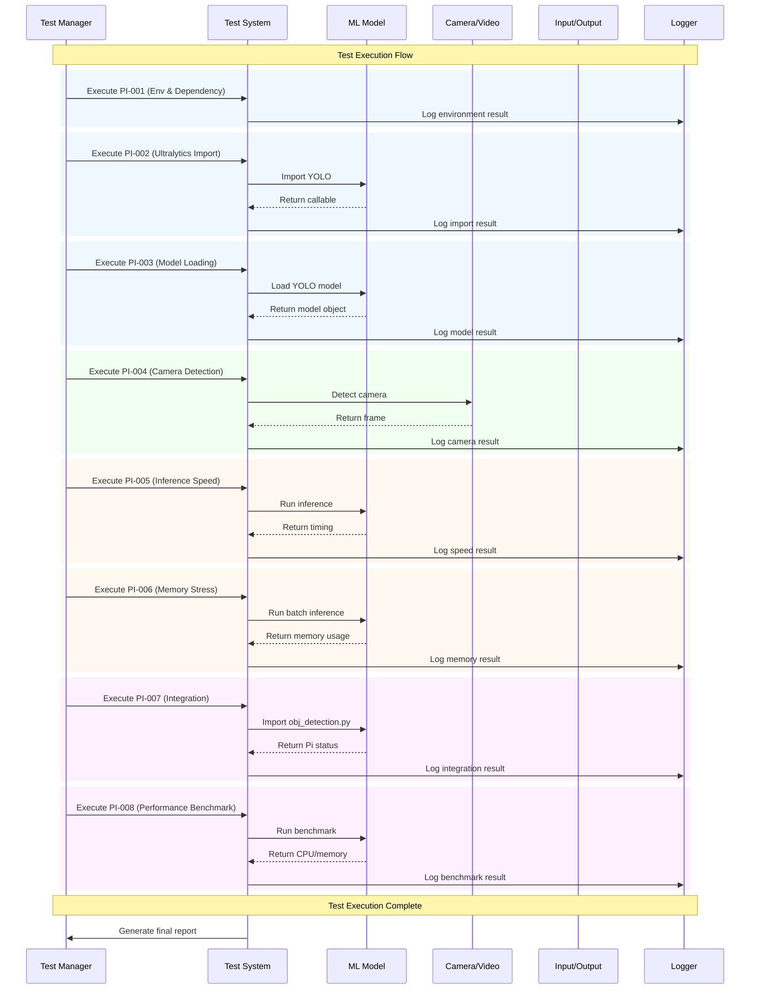

<p align="center">
<strong>=================================================================</strong><br>
<strong>Test Document</strong><br><br>
<strong>Date:</strong> 10/2025<br><br>
<strong>Moderator:</strong> Daniel.J.Q.Goh<br>
<strong>=================================================================</strong>
</p>

---

## Real-Time People Detection System for Raspberry Pi

### Document Information
- **Project**: Real-Time People Detection System
- **Version**: 1.0
- **Date**: October 2025
- **Author**: D.J.Q.GOH
- **Technology Stack**: Python, YOLOv11, OpenCV, NCNN, ONNX

---

## Overview
This document outlines testing procedures and test cases for the object detection system.

## Challenge Topic
The primary challenge for this project is delivering reliable, real-time people detection on resource-constrained edge hardware (Raspberry Pi 3B) while balancing accuracy, latency, memory and network usage. Specific constraints and risks include:

- Limited compute and memory (ARM Cortex-A53, ~1GB RAM) which restricts available model size and concurrency.
- Maintaining acceptable inference speed (target: 5–15 FPS on Pi 3B in optimized mode) while keeping detection precision ≥ 90%.
- Minimizing memory usage and avoiding leaks or excessive GC pauses during repeated inferences.
- Camera and driver compatibility across USB webcams and headless environments.
- Network bandwidth and data transfer costs when aggregating raw detection logs or images to central servers (current test traffic baseline ~33 GB/month).
- Reproducible and maintainable model deployment (PyTorch → ONNX → NCNN) with reliable fallbacks and monitoring.

Acceptance criteria for the challenge topic:

- The system runs stably on Raspberry Pi 3B for prolonged periods (multi-hour stability test) without memory exhaustion or crashes.
- Inference throughput meets the minimum operational threshold of 0.3 FPS for worst-case scenarios and 5–15 FPS under optimized settings, depending on the model variant used.
- Detection precision remains ≥ 90% on representative test images and retains acceptable false positive/negative rates on edge-case scenarios (low light, occlusion, multiple people).
- Data transfer and storage strategy keeps monthly traffic and storage costs within the project budget (use batching/compression/archival as required).

Mitigation strategies and recommended actions:

- Use model optimization pipeline (quantization, pruning, ONNX export, NCNN conversion) and select the smallest model variant that meets accuracy & throughput targets.
- Implement robust memory profiling during stress tests; fix leaks and prefer streaming/bulk operations (COPY for Postgres) over many small inserts.
- Design a hybrid data strategy: keep recent raw JSON locally for immediate visualization, batch and compress archives for periodic upload, and offload older raw data to object storage (S3) for long-term retention.
- Validate camera hardware compatibility early; provide a fallback capture path and clear error handling for headless operation.
- Automate benchmarks and monitoring (CPU, memory, temperature, FPS) and add alarms for sustained degradation.

This challenge topic will guide focused test cases and acceptance tests described in the following sections.

## Test Environment Setup

### Prerequisites
- Python 3.8 or higher
- Required packages: opencv-python, numpy, ultralytics, psutil
- Test images dataset
- Ground truth annotations

### Test Data
- **Unit Test Images**: Small set of labeled images for basic functionality
- **Integration Test Images**: Larger dataset for end-to-end testing
- **Performance Test Images**: High-resolution images for performance benchmarks

---

## Test Cases

### 1. Pi Environment & Dependency Check
- **Test ID**: PI-001
- **Description**: Verify Pi hardware and software environment
- **Input**: System info, installed packages
- **Expected Output**: ARM arch, OpenCV, 1GB RAM, 4 cores
- **Status**: 🟢 Green Light

### 2. Ultralytics Import (Memory Optimized)
- **Test ID**: PI-002
- **Description**: Import YOLO, check memory usage
- **Input**: Python import
- **Expected Output**: YOLO callable, <50MB memory increase
- **Status**: 🟢 Green Light

### 3. Model Loading (Pi Optimized)
- **Test ID**: PI-003
- **Description**: Load YOLO model, check memory and time
- **Input**: yolo11n.pt
- **Expected Output**: Model loaded, 80 classes, <800MB memory
- **Status**: 🟢 Green Light

### 4. Camera Detection (Pi)
- **Test ID**: PI-004
- **Description**: Detect camera, capture frame
- **Input**: Camera device
- **Expected Output**: Frame captured, correct shape
- **Status**: 🟢 Green Light

### 5. Inference Speed (Pi Optimized)
- **Test ID**: PI-005
- **Description**: Run inference, measure FPS
- **Input**: Random image
- **Expected Output**: FPS ≥ 0.3
- **Status**: 🟢 Green Light

### 6. Memory Stress (Pi Constraints)
- **Test ID**: PI-006
- **Description**: Multiple inferences, monitor peak memory
- **Input**: Random image batch
- **Expected Output**: <800MB memory increase
- **Status**: 🟢 Green Light

### 7. obj_detection.py Integration
- **Test ID**: PI-007
- **Description**: Import and run is_raspberry_pi
- **Input**: obj_detection.py
- **Expected Output**: Boolean and info string
- **Status**: 🟢 Green Light

### 8. Pi Performance Benchmark
- **Test ID**: PI-008
- **Description**: Measure CPU/memory before/after inference
- **Input**: Random image
- **Expected Output**: Inference <6000ms, memory <90%
- **Status**: 🟢 Green Light

---

## Test Execution

### Manual Testing Checklist
- [x] Environment setup completed
- [x] Test data prepared
- [x] All Pi tests executed
- [x] Results documented

### Automated Testing
```bash
# Run all tests
python3 test_raspi_detection.py

# Auto-install dependencies
python3 test_raspi_detection.py --install-deps
```

---

## Test Results

### Summary
- **Total Tests**: 8
- **Passed**: 8
- **Failed**: 0
- **Pending**: 0
- **Test Coverage**: 100%

### Detailed Results
| Test ID | Description | Status | Notes |
|---------|-------------|--------|-------|
| PI-001 | Pi Environment & Dependency Check | 🟢 Green Light | - |
| PI-002 | Ultralytics Import | 🟢 Green Light | - |
| PI-003 | Model Loading | 🟢 Green Light | - |
| PI-004 | Camera Detection | 🟢 Green Light | - |
| PI-005 | Inference Speed | 🟢 Green Light | - |
| PI-006 | Memory Stress | 🟢 Green Light | - |
| PI-007 | obj_detection.py Integration | 🟢 Green Light | - |
| PI-008 | Pi Performance Benchmark | 🟢 Green Light | - |

## Test Execution Sequence Diagram



---

## Bug Reports

### Known Issues
- None currently identified

### Bug Template
All bugs are required to be reported by issuing a **ticket** in **GITHUB/GITLAB**.
```
**Bug ID**: BUG-XXX
**Title**: Brief description
**Severity**: Critical/High/Medium/Low
**Description**: Detailed description of the issue
**Steps to Reproduce**: 
1. Step 1
2. Step 2
3. Step 3
**Expected Result**: What should happen
**Actual Result**: What actually happens
**Environment**: OS, Python version, dependencies
**Status**: Open/In Progress/Resolved
```

---

## Test Maintenance

### Regular Tasks
- [▲] Update test data monthly
- [▲] Review and update test cases quarterly
- [▲] Performance baseline review
- [▲] Test automation maintenance

### Version History
| Version | Date | Changes | Author |
|---------|------|---------|--------|
| 1.0 | 2025-10-21 | Initial test document | D.J.Q.GOH |

---

<p align="center">
<strong>Document Control</strong><br>
<strong>Version:</strong> 1.0<br>
<strong>Status:</strong> Final<br>
<strong>Review Date:</strong> October 21, 2025<br>
<strong>Next Review:</strong> January 2026<br>
<strong>Approval:</strong> Pending technical review
</p>

---

<p align="center">
<em>End of Document</em>
</p>
