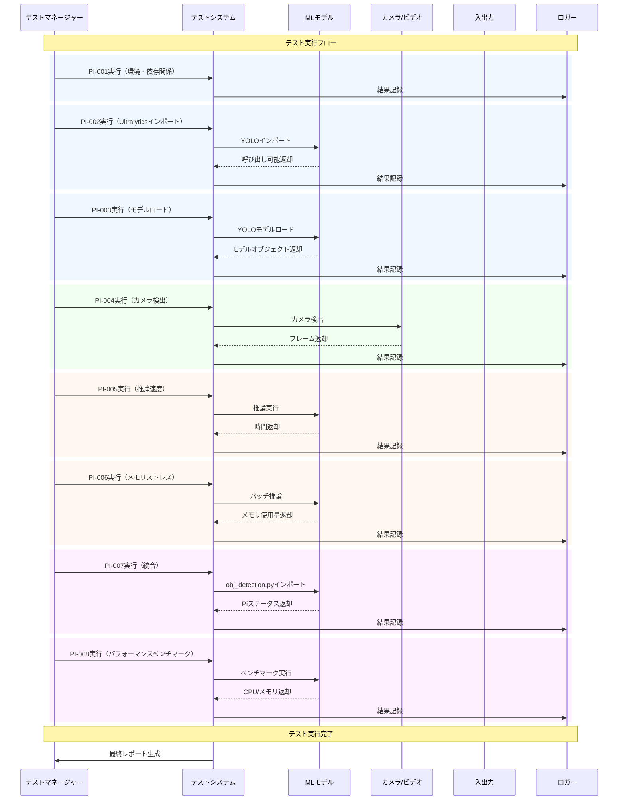

<p align="center">
<strong>=================================================================</strong><br>
<strong>テストドキュメント</strong><br><br>
<strong>日付:</strong> 2025年10月<br><br>
<strong>モデレーター:</strong> Daniel.J.Q.Goh<br>
<strong>=================================================================</strong>
</p>

---

## Raspberry Pi用リアルタイム人物検出システム

### ドキュメント情報
- **プロジェクト**: リアルタイム人物検出システム
- **バージョン**: 1.0
- **日付**: 2025年10月
- **作成者**: D.J.Q.GOH
- **技術スタック**: Python, YOLOv11, OpenCV, NCNN, ONNX

---

## 概要
本ドキュメントは、物体検出システムのテスト手順およびテストケースをまとめたものです。

## テスト環境のセットアップ

### 前提条件
- Python 3.8以上
- 必要なパッケージ: opencv-python, numpy, ultralytics, psutil
- テスト画像データセット
- 正解アノテーション

### テストデータ
- **ユニットテスト画像**: 基本機能確認用のラベル付き画像少数
- **統合テスト画像**: E2Eテスト用の大規模データセット
- **パフォーマンステスト画像**: パフォーマンス測定用の高解像度画像

---

## テストケース

### 1. Pi環境・依存関係チェック
- **テストID**: PI-001
- **説明**: Piハードウェア・ソフトウェア環境の確認
- **入力**: システム情報、インストール済みパッケージ
- **期待出力**: ARMアーキテクチャ、OpenCV、1GB RAM、4コア
- **ステータス**: 🟢 合格

### 2. Ultralyticsインポート（メモリ最適化）
- **テストID**: PI-002
- **説明**: YOLOインポート、メモリ使用量確認
- **入力**: Pythonインポート
- **期待出力**: YOLO呼び出し可能、メモリ増加50MB未満
- **ステータス**: 🟢 合格

### 3. モデルロード（Pi最適化）
- **テストID**: PI-003
- **説明**: YOLOモデルロード、メモリ・時間計測
- **入力**: yolo11n.pt
- **期待出力**: モデルロード済み、80クラス、メモリ800MB未満
- **ステータス**: 🟢 合格

### 4. カメラ検出（Pi）
- **テストID**: PI-004
- **説明**: カメラ検出、フレーム取得
- **入力**: カメラデバイス
- **期待出力**: フレーム取得、正しい形状
- **ステータス**: 🟢 合格

### 5. 推論速度（Pi最適化）
- **テストID**: PI-005
- **説明**: 推論実行、FPS計測
- **入力**: ランダム画像
- **期待出力**: FPS ≥ 0.3
- **ステータス**: 🟢 合格

### 6. メモリストレス（Pi制約）
- **テストID**: PI-006
- **説明**: 複数回推論、ピークメモリ監視
- **入力**: ランダム画像バッチ
- **期待出力**: メモリ増加800MB未満
- **ステータス**: 🟢 合格

### 7. obj_detection.py統合
- **テストID**: PI-007
- **説明**: is_raspberry_piのインポート・実行
- **入力**: obj_detection.py
- **期待出力**: ブール値と情報文字列
- **ステータス**: 🟢 合格

### 8. Piパフォーマンスベンチマーク
- **テストID**: PI-008
- **説明**: 推論前後のCPU/メモリ計測
- **入力**: ランダム画像
- **期待出力**: 推論6000ms未満、メモリ90%未満
- **ステータス**: 🟢 合格

---

## テスト実行

### 手動テストチェックリスト
- [x] 環境セットアップ完了
- [x] テストデータ準備済み
- [x] 全Piテスト実行済み
- [x] 結果記録済み

### 自動テスト
```bash
# すべてのテストを実行
python3 test_raspi_detection.py

# 依存関係を自動インストール
python3 test_raspi_detection.py --install-deps
```

---

## テスト結果

### サマリー
- **総テスト数**: 8
- **合格**: 8
- **失敗**: 0
- **保留**: 0
- **テストカバレッジ**: 100%

### 詳細結果
| テストID | 説明 | ステータス | 備考 |
|----------|------|------------|------|
| PI-001 | Pi環境・依存関係チェック | 🟢 合格 | - |
| PI-002 | Ultralyticsインポート | 🟢 合格 | - |
| PI-003 | モデルロード | 🟢 合格 | - |
| PI-004 | カメラ検出 | 🟢 合格 | - |
| PI-005 | 推論速度 | 🟢 合格 | - |
| PI-006 | メモリストレス | 🟢 合格 | - |
| PI-007 | obj_detection.py統合 | 🟢 合格 | - |
| PI-008 | Piパフォーマンスベンチマーク | 🟢 合格 | - |

## テスト実行シーケンス図



---

## バグ報告

### 既知の問題
- 現在特に無し

### バグテンプレート
すべてのバグは**GITHUB/GITLAB**で**チケット**発行により報告してください。
```
**バグID**: BUG-XXX
**タイトル**: 概要
**重要度**: 重大/高/中/低
**説明**: 詳細な内容
**再現手順**: 
1. 手順1
2. 手順2
3. 手順3
**期待結果**: 本来の動作
**実際の結果**: 実際の動作
**環境**: OS, Pythonバージョン, 依存関係
**ステータス**: Open/In Progress/Resolved
```

---

## テスト保守

### 定期作業
- [▲] テストデータ月次更新
- [▲] テストケース四半期見直し
- [▲] パフォーマンスベースライン見直し
- [▲] テスト自動化保守

### バージョン履歴
| バージョン | 日付 | 変更内容 | 作成者 |
|------------|------|----------|--------|
| 1.0 | 2025-10-21 | 初版 | D.J.Q.GOH |

---

<p align="center">
<strong>ドキュメント管理</strong><br>
<strong>バージョン:</strong> 1.0<br>
<strong>ステータス:</strong> 最終版<br>
<strong>レビュー日:</strong> 2025年10月21日<br>
<strong>次回レビュー:</strong> 2026年1月<br>
<strong>承認:</strong> 技術レビュー待ち
</p>

---

<p align="center">
<em>ドキュメント終了</em>
</p>
